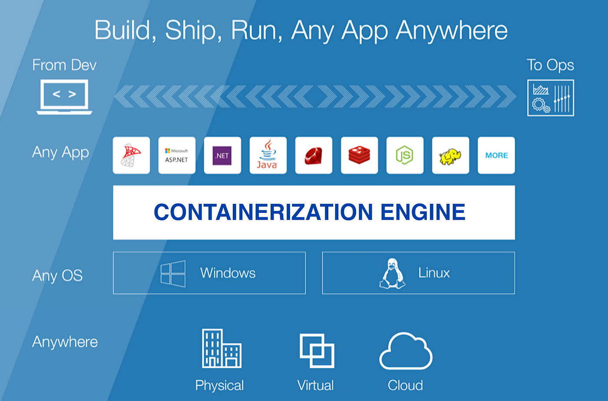

# What is Containerization?
{: .no_toc }

Table of Contents
{: .no_toc .text-delta }

- TOC
{:toc}

---

**Containerization** is a method of packaging, distributing, and running applications and their dependencies within isolated environments called containers. Each container encapsulates the application code, runtime, system tools, libraries, and settings necessary for the application to run reliably across different computing environments.

Image Reference: [What Is Containerization?](https://medium.com/hackernoon/what-is-containerization-83ae53a709a6)

### Key components

- **Container Engine**: Software that manages the lifecycle of containers, including creating, starting, stopping, and deleting them. Docker and containerd are popular container engines.

- **Container Images**: Lightweight, standalone, executable packages that contain everything needed to run a piece of software, including code, runtime, libraries, and dependencies. Images are immutable and can be versioned.

- **Container Orchestration**: Tools that automate the deployment, scaling, and management of containers across a cluster of servers. Kubernetes is the most widely used container orchestration platform.

- **Container Registry**: A repository for storing and distributing container images. Examples include Docker Hub, Google Container Registry, and Amazon Elastic Container Registry.

### Use Cases

- **Application Deployment and Portability**: Containerization enables developers to package applications along with their dependencies, making it easier to deploy them consistently across different environments, such as development, testing, and production. This portability ensures that applications behave the same regardless of the underlying infrastructure.

- **Microservices Architecture**: Containerization facilitates the adoption of microservices architecture by allowing each microservice to run in its own container. This approach promotes modularity, scalability, and fault isolation, making it easier to develop, deploy, and maintain complex applications.

- **Continuous Integration/Continuous Deployment (CI/CD)**: Containers streamline the CI/CD pipeline by providing a consistent environment for building, testing, and deploying applications. Developers can create container images containing their application code and dependencies, which can then be automatically tested and deployed using CI/CD tools like Jenkins or GitLab CI.

- **Hybrid and Multi-cloud Deployments**: Containers abstract away the underlying infrastructure, making it easier to deploy applications across hybrid and multi-cloud environments. Developers can build once and deploy anywhere, whether it's on-premises, in the cloud, or across multiple cloud providers.

- **Resource Efficiency and Scalability**: Containers are lightweight and share the host operating system's kernel, resulting in faster startup times and lower resource overhead compared to virtual machines. This efficiency allows organizations to maximize resource utilization and scale applications more efficiently to meet changing demand.

- **DevOps Practices**: Containerization aligns with DevOps principles by promoting collaboration between development and operations teams. Developers can package their applications into containers, which can then be seamlessly deployed and managed by operations teams using container orchestration platforms like Kubernetes.

### Containerization vs Virtualization

Containerization and virtualization are both technologies used to deploy and manage applications, but they operate at different levels of abstraction and have distinct characteristics. Here's a comparison between containerization and virtualization:

1. **Abstraction Level**:
   - **Containerization**: Containers operate at the operating system level, sharing the host OS kernel and providing isolated environments for applications to run. Each container encapsulates the application code, runtime, libraries, and dependencies.
   - **Virtualization**: Virtual machines (VMs) abstract the entire hardware stack, including the physical hardware, operating system, and applications. Each VM runs its own complete operating system and emulates virtual hardware.

2. **Resource Overhead**:
   - **Containerization**: Containers are lightweight and share the host OS kernel, resulting in minimal resource overhead. They consume fewer resources compared to VMs and have faster startup times.
   - **Virtualization**: Virtual machines have higher resource overhead because they require a separate operating system kernel and virtualized hardware for each VM. This overhead includes memory, CPU, and disk space.

3. **Isolation**:
   - **Containerization**: Containers provide process-level isolation, meaning each container has its own filesystem, network namespace, and process space. However, containers share the same kernel, which can introduce potential security risks if not properly configured.
   - **Virtualization**: Virtual machines offer stronger isolation since each VM runs its own complete operating system instance, including its own kernel. This isolation provides better security and ensures that applications running on different VMs do not interfere with each other.

4. **Portability**:
   - **Containerization**: Containers are highly portable because they encapsulate all dependencies, making it easy to deploy applications consistently across different environments. Container images can be run on any container runtime that supports the container format (e.g., Docker).
   - **Virtualization**: Virtual machines are less portable compared to containers because they include the entire guest operating system. Moving VMs between different hypervisors or cloud platforms may require additional configuration and conversion steps.

5. **Performance**:
   - **Containerization**: Containers generally offer better performance compared to virtual machines due to their lightweight nature and reduced resource overhead. Containers have faster startup times and lower latency, making them well-suited for microservices architectures and cloud-native applications.
   - **Virtualization**: Virtual machines may have higher performance overhead due to the need for virtualized hardware and additional layers of abstraction. However, advancements in virtualization technology have reduced this overhead significantly in recent years.

In summary, containerization and virtualization are both valuable technologies with distinct advantages and use cases. Containerization is well-suited for deploying lightweight, portable applications with minimal resource overhead, while virtualization provides stronger isolation and flexibility for running multiple operating systems on the same physical hardware. Organizations often use a combination of both containerization and virtualization technologies to meet their diverse application deployment needs.

### Containerization vs Virtualization: Summary Table

| Feature                  | Containerization                                | Virtualization                                |
|--------------------------|-------------------------------------------------|-----------------------------------------------|
| Abstraction Level        | Operating system level                           | Hardware level                                |
| Resource Overhead        | Minimal, lightweight                             | Higher, due to virtualized hardware and OS    |
| Isolation                | Process-level isolation                         | Stronger isolation with separate OS instances |
| Portability              | Highly portable, encapsulates dependencies       | Less portable, includes entire OS             |
| Performance              | Generally better due to lightweight nature       | May have higher overhead, but improving       |
| Deployment Speed         | Faster startup times                            | Slower startup times                          |
| Management Complexity    | Generally simpler                               | More complex due to multiple OS instances     |
| Security                 | Process isolation, potential kernel sharing     | Stronger isolation, less kernel sharing       |
| Use Cases                | Cloud-native applications, microservices         | Legacy applications, multi-OS environments    |

Overall, containerization provides a flexible and efficient way to package, deploy, and manage applications, enabling organizations to innovate faster and deliver value to their customers more efficiently.
