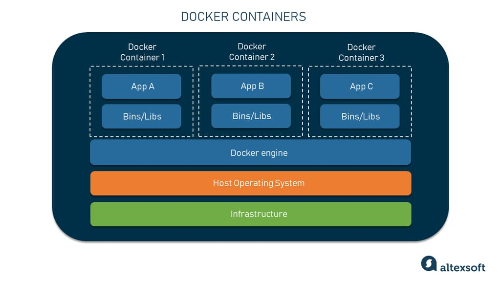
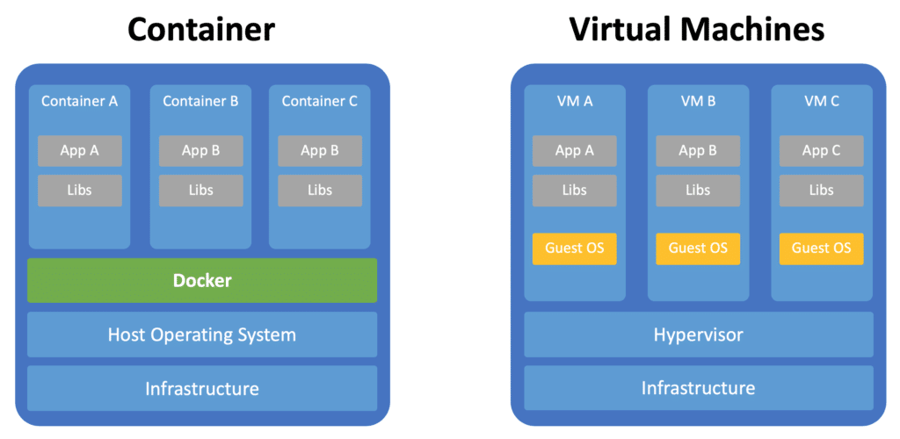

# What is Docker?
{: .no_toc }

Table of Contents
{: .no_toc .text-delta }

- TOC
{:toc}

---

**Docker** is a platform that enables developers to develop, deploy, and run applications in containers. These containers are lightweight, portable, and scalable, allowing applications to be easily packaged with all their dependencies and run consistently across different environments. Docker provides tools for creating, managing, and orchestrating containers, simplifying the process of building and deploying software.

Image Reference: [The Good and the Bad of Docker Containers](https://www.altexsoft.com/blog/docker-pros-and-cons/)

### Use Cases

1. **Microservices Architecture**: Docker facilitates the adoption of microservices architecture by allowing each microservice to run in its own container. This approach promotes modularity, scalability, and fault isolation, making it easier to develop, deploy, and maintain complex applications.

2. **Continuous Integration/Continuous Deployment (CI/CD)**: Docker streamlines the CI/CD pipeline by providing a consistent environment for building, testing, and deploying applications. Developers can create container images containing their application code and dependencies, which can then be automatically tested and deployed using CI/CD tools like Jenkins or GitLab CI.

3. **Hybrid and Multi-cloud Deployments**: Docker abstracts away the underlying infrastructure, making it easier to deploy applications across hybrid and multi-cloud environments. Developers can build once and deploy anywhere, whether it's on-premises, in the cloud, or across multiple cloud providers.

4. **Resource Efficiency and Scalability**: Docker containers are lightweight and share the host operating system's kernel, resulting in faster startup times and lower resource overhead compared to virtual machines. This efficiency allows organizations to maximize resource utilization and scale applications more efficiently to meet changing demand.

5. **DevOps Practices**: Docker aligns with DevOps principles by promoting collaboration between development and operations teams. Developers can package their applications into containers, which can then be seamlessly deployed and managed by operations teams using container orchestration platforms like Kubernetes.

### Dockerfile vs Docker Image vs Docker Container

| Feature            | Dockerfile                                        | Docker Image                                     | Docker Container                                 |
|--------------------|---------------------------------------------------|--------------------------------------------------|-------------------------------------------------|
| Definition         | A text file containing instructions to build an image | A packaged, standalone, executable software bundle | A running instance of a Docker image           |
| Contents           | Instructions for building an image layer by layer | A snapshot of an image at a specific point in time | An instantiation of an image, including the application and runtime environment |
| Creation           | Created by users to define image build process    | Created by building Dockerfile using `docker build` | Created by running an image using `docker run`  |
| Immutable          | No, can be edited and updated                     | Yes, cannot be modified once built             | N/A                                             |
| Usage              | Specifies how an image is built                   | The template for running containers            | The runtime instance of an image               |

### Docker vs Virtual Machine (VM)

| Feature            | Docker                                            | Virtual Machine (VM)                            |
|--------------------|---------------------------------------------------|-------------------------------------------------|
| Technology         | Containerization technology, using OS-level virtualization | Hypervisor-based virtualization technology      |
| Isolation          | Process-level isolation using namespaces and cgroups | Hardware-level isolation with virtualized hardware |
| Overhead           | Lower resource overhead, shares host OS kernel    | Higher resource overhead, each VM includes its own OS |
| Startup Time       | Faster startup time due to lightweight containers | Slower startup time due to booting a full OS   |
| Resource Usage     | More efficient resource usage, containers share resources | Less efficient resource usage, each VM consumes dedicated resources |
| Portability        | Highly portable across different environments    | Portable but less lightweight compared to containers |

Docker has revolutionized the way developers build, ship, and run applications, providing a seamless and efficient containerization platform that promotes portability, scalability, and consistency across diverse computing environments.